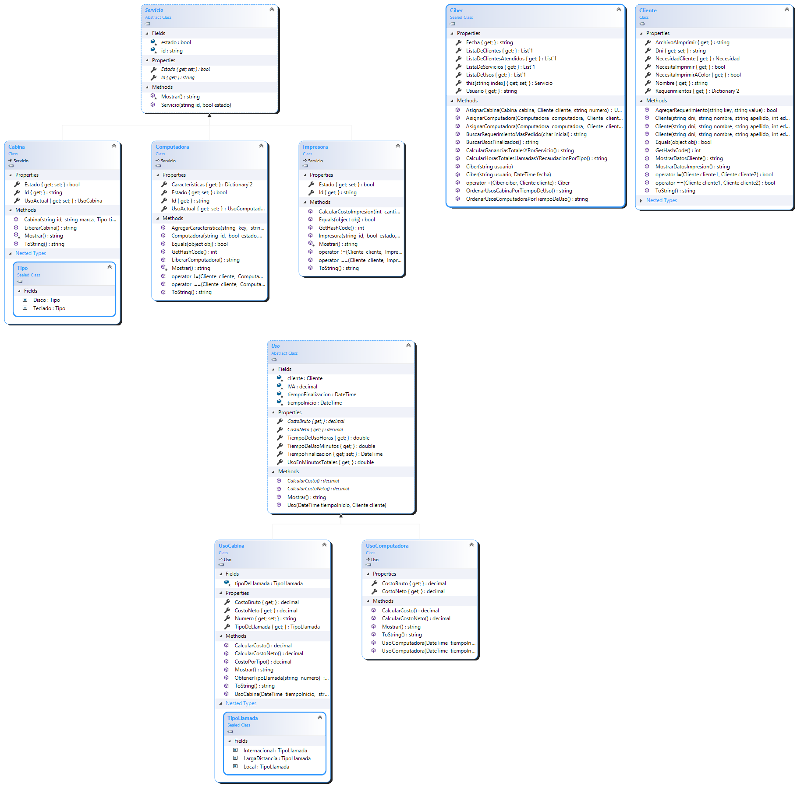

# Ciber "En el 2000"

*UTNFra Laboratorio de Computación II - Primer Parcial - Comisión 2do D - 2do cuatrimestre 2021*

[Enunciado del parcial](https://codeutnfra.github.io/programacion_2_laboratorio_2_apuntes/docs/evaluaciones/parciales/2d-primer-parcial/)

## Sobre mí

¡Hola! Me llamo Sofía  y a los 14 empecé a ir al ciber que quedaba a una cuadra de mi casa en Flores para poder chatear con una de mis mejores amigas que se había ido a vivir a Alemania. 13 años después mi (ex) amiga sigue viviendo en Alemania pero ya no chateamos y yo estoy tratando de hacer este sistema para administrar un ciber. Este año arranqué la carrera y antes de esto solo había hecho algunos cursos de javaScript, HTML y eso durante el 2020 para mantenerme distraída y "aprovechar" el tiempo en casa. Como trabajo en una escuela primaria como acompañante de un nene con discapacidad y el año pasado no tuvimos clases presenciales tuve mucho tiempo para pensar y entrar en crisis con mi *otra carrera.* Estudié Letras, hice la orientación en Lingüística y psicolingüística y me interesa mucho la lingüística computacional. Toda esta introducción es para decir que me costó bastante abordar el parcial, estoy recién aprendiendo y no vengo con bases de otro lenguaje ni de un ambiente similar. También estoy aprendiendo a manejar la frustración cuando no se como solucionar los errores o cuando algo no hace lo que yo quiero. A pesar de esto siento que aprendí muchísimo con el parcial, la pasé bastante bien y estoy contenta porque al menos, al parecer, funciona. 

[En el 2000 - Natalia Lafourcade](https://www.youtube.com/watch?v=czodavRkUuE&ab_channel=NLaFourcadeVEVO)

## Resumen

Esta aplicación permite gestionar la utilización de computadoras y cabinas telefónicas en un ciber. Cuenta con una lista de clientes que esperan ser atendidos, la cual muestra el nombre del cliente junto a el servicio que desea utilizar y en el caso de que desee utilizar una computadora también muestra específicamente que necesita que la computadora tenga ya sea un periférico o un juego o software. También se pueden ver todos los servicios del ciber y sus estados. Si el botón del servicio esta verde es porque no esta siendo utilizado, en cambio si esta rojo es porque esta ocupado. 

Para asignar un cliente a una computadora o cabina es necesario seleccionar al cliente de la lista y presionar el botón que corresponda al servicio que el cliente desea utilizar. 

- Asignación de computadoras: Una vez seleccionado el cliente, si lo que solicita es una computadora, al presionar el botón *Asginar computadora* se abre un nuevo formulario que muestra todas las computadoras que posee el ciber junto a sus especificaciones, los programas y juegos que tiene cargados y los perifericos que tiene y funcionan. Para poder asignarle una computadora al cliente se debe seleccionar una computadora libre que contenga lo que el cliente necesita y marcar la opción de Tiempo libre si el cliente no especifica cuanto tiempo desea utilizar la computadora y en el caso de que si lo especifique se debe seleccionar la cantidad de tiempo que se le asignará. En este momento ya se puede presionar el botón *Asignar.* Si hay alguna computadora libre seleccionada y si esta es la adecuada para el cliente se asignará la computadora y se cerrará el formulario.
- Asignación de cabinas: Una vez seleccionado el cliente, si lo que solicita es una cabina, al presionar el botón *Asignar cabina* se abre un nuevo formulario que muestra todas las cabinas del ciber. Para poder asignarle una cabina al cliente se debe seleccionar una cabina libre y se debe ingresar el número al que el cliente desea llamar. Para esto se puede utilizar la botonera o se puede cargar el número por teclado. Luego de seleccionar la cabina e ingresar el número se puede presionar el botón *Asignar* para poder asignarle la cabina al cliente. Si el número ingresado no es correcto o no se ha ingresado ningún número no será posible la asignación. Si el numero es correcto se asignará la cabina y se cerrará el formulario.

Para **finalizar el uso de un servicio** se debe presionar el botón que esta al lado del servicio. Esto solo puede realizarse si el servicio esta siendo utilizado, es decir cuando el botón es color rojo y se muestra "En uso". Al presionar el botón se mostrará un mensaje con los datos del uso que ha finalizado, es decir el cliente, la hora de inicio y finalización, cuántos minutos fue utilizado y el costo a abonar por el cliente. Además se liberará el servicio. En el caso de las computadoras a las que se les asignó un tiempo de uso determinado, estas terminarán su alquiler automáticamente una vez que haya transcurrido el tiempo solicitado. Cuando esto suceda se mostrará un mensaje por pantalla con los datos del alquiler y se liberará la computadora. 

La aplicación permite ver las **estadísticas históricas** del local. Para consultarlas se debe presionar el botón *Estadísticas históricas,* el cual abrirá un nuevo formulario que permitirá seleccionar el dato que se quiere visualizar. 

Cada formulario cuenta con un botón de ayuda que explica su funcionamiento. 

## Diagrama de clases

No pude agregar la clase Servicio al diagrama. No sé por qué pero lo voy a solucionar para el recuperatorio. Tampoco se muestran los atributos de todas las clases. 

## Justificación técnica

### [Clase 01 - Introducción a .NET y C](https://codeutnfra.github.io/programacion_2_laboratorio_2_apuntes/docs/clases/introduccion)

- Utilicé `decimal` para los valores fraccionarios relacionados con dinero por su precisión y los mostré con el método AppendFormat de StringBuilder y la notación `{0:C2}` para mostrar el valor con formato de precio y dos decimales.
- Para el estado de los servicios decidí utlizar el tipo booleano porque  hay solo dos estados posibles en este contexto: en uso y libre. Este tipo de dato me facilitó la configuración de los botones de estado evaluando si el equipo esta disponible o no para configurar el color del botón, la habilitación y el texto que muestra.

### [Clase 02 - Clases y métodos estático](https://codeutnfra.github.io/programacion_2_laboratorio_2_apuntes/docs/clases/estaticos)s

- Utilicé un método estático para obtener el tipo de llamada a partir de un número ingresado por parámetro porque esta tarea es concreta y no depende de una instancia para ser ejecutada. `public static UsoCabina.TipoLlamada ObtenerTipoLlamada(string numero)` 
De hecho, necesito el tipo de llamada para poder instanciar una llamada. Necesito ejecutar un método que reciba un número y retorne el tipo de llamada que se hará con ese número. Luego este dato podrá ser usado como parametro para construir un objeto del tipo UsoCabina. Este método es `public` ya que necesito que sea accesible desde otras partes de mi proyecto. No podría ser `private` porque no es llamado desde la misma clase.

### [Clase 03 - Programación orientada a objet](https://codeutnfra.github.io/programacion_2_laboratorio_2_apuntes/docs/clases/objetos)os

- Abordé el diseño de las clases para este trabajo basándome en el principio de la **abstracción**, pensando en qué necesito de cada elemento que constituye a un ciber que sea relevante para una aplicación que gestione su uso. Primero pensé en los objetos concretos que hay en un ciber: computadoras y cabinas telefónicas. De estos elementos no me resultaron relevantes,  para mi contexto de negocio, por ejemplo su color, su tamaño, fecha de fabricación u otro datos que podrían ser relevantes en otro contexto sino su marca y tipo en el caso de las cabinas o la memoria RAM, la placa de video y el procesador de cada computadora.
- Implementé la abstracción de estos elementos necesarios para mi contexto de negocio en distintas clases. Servicio, Computadora y Cabina representan abstracciones de los objetos físicos que se encuentran en el ciber. Por otro lado, Uso, UsoCabina y UsoComputadora representan el alquiler o utilización de un servicio por parte de un cliente. Los atributos y métodos relacionados a los clientes del ciber los agrupé en la clase Cliente y todo lo necesario para le funcionamiento
- Implementé la abstracción de estos elementos necesarios para mi contexto de negocio en distintas clases: Servicio, Computadora y Cabina representan abstracciones de los objetos físicos que se encuentran en el ciber. Por otro lado, Uso, UsoCabina y UsoComputadora representan el alquiler o utilización de un servicio por parte de un cliente. Los atributos y métodos relacionados a los clientes del ciber los agrupé en la clase Cliente y todo lo necesario para el funcionamiento del ciber en la clase Ciber.
- Utilicé el modificador `protected` en los atributos de la clase Uso y Servicio para que puedan ser utilizados en sus clases derivadas.
- Instancié 10 objetos del tipo Computadora y 5 del tipo Cabina, cada uno con valores distintos para simular variedad en el ciber. Es posible ver cambios en el estado de cada cabina o computadora  en distintos momentos de la aplicación, ya que por ejemplo en un momento pueden tener el atributo `estado` seteado en `true`  cuando la computadora esta libre y luego en `false` cuando esta ocupada.

### [Clase 04 - Sobrecarga](https://codeutnfra.github.io/programacion_2_laboratorio_2_apuntes/docs/sobrecarga)

- Sobrecargué el constructor de UsoComputadora para que se pueda instanciar un uso con un tiempo de finalizacion ya pautado. Esto me pareció necesario para los clientes que piden una computadora por un tiempo determinado. Los usos de cabina o de computadoras por tiempo libre se instancian sin pasar el tiempo de finalización como parámetro (que se inicializa en el valor minimo de DateTime) y en estos casos el tiempo de finalización se setea cuando el usuario finaliza el uso.
- Sobrecargué el operador == en la clase Cliente para comparar un Cliente con una Computadora y ver si hay algún requerimiento que tenga el cliente que la computadora no. Esto me sirvió para el formulario de asignación de computadoras que solo permite asignar una computadora si tiene todo lo que el cliente necesita.
- En la clase Ciber sobrecargué el operador + para poder utilizarlo para añadir clientes a la lista de clientes en espera del ciber. Dentro de esta implementación validé que el cliente no se encuentre ya en la lista reutilizando el codigo de otra sobrecarga de == que compara dos objetos Cliente por su número de Dni.

### [Clase 05 - Windows Forms](https://codeutnfra.github.io/programacion_2_laboratorio_2_apuntes/docs/forms)

- Utilicé 4 formularios para la aplicación.  En todos utilicé botones para poder realizar acciones y abrir otros formularios. En el principal también use los botones para marcar el estado de los servicios mediante el cambio de color y de texto. Este cambio lo manejé con en un método que evalúa el estado de cada servicio y según su estado configura las propiedades del botón. El bloqueo y desbloqueo del ChechBox de Tiempo Libre en el form de computadoras también lo manejé desde el código. Manejar las propiedades desde el código a través de métodos me permitió hacer más dinámica la interfaz de usuario. Dejando esto de lado, casi todas las propiedades las modifiqué desde el Designer.
- De los controles que ofrece WindowsForms, además de Button y CheckBox utilicé RadioButton para las computadoras y cabinas ya que solo se puede elegir una a la vez y GroupBox para agrupar los elementos y luego poder recorrerlos en el código para constatar que haya uno seleccionado y cual.
- Para manejar el tiempo dentro de la aplicación decidí usar el elemento Timer. Lo configuré para que cada 5 segundos ejecute el evento Tick. Dentro de este evento invoqué al método `BuscarUsosFinalizados()` que recorre los usos de servicios que estan funcionando en el momento y que tienen un tiempo de finalización establecido es decir que son de los clientes que alquilaron una computadora por un tiempo determinado. Este método busca algun uso cuyo tiempo de finalización sea anterior al tiempo en el momento que se esta ejecutando la acción. Si encuentra uno lo devuelve y luego se muestra por pantalla y finaliza el uso del servicio. Es la forma más accesible que encontré para darle el alta a los usuarios automaticamente cuando se haya cumplido el tiempo. La principal desventaja es que no finaliza exactamente cuando se cumple el tiempo sino cuando se ejecuta el tick del timer, de esta forma puede suceder que termine un uso y haya algunos segundos de espera hasta que finaliza y se libera la máquina. En cuanto a si es performante o no utilizar este elemento y ejecutar un método cada 5 segundos no lo sé, y probablemente no lo sea, pero me pareció una buena solución por el momento.

### [Clase 06 - Colecciones](https://codeutnfra.github.io/programacion_2_laboratorio_2_apuntes/docs/colecciones)

- Utilicé varias **List** de distintos tipos para desarrollar el programa por su versatilidad y facilidad para recorrerlas. Para los clientes en espera decidí utilizar una lista para poder seleccionar cualquier cliente en la lista de espera mostrada en el listBox. Había pensado en usar una Queue al principio pero pense en el caso hipotético de que todas las cabinas estén ocupadas y el siguiente cliente en la fila quiera usar una cabina debería esperar a que una se libere y no podría elegir a un cliente de atrás que quizás esté esperando para usar una computadora. También pensé en hacer dos filas por separado pero podría existir el mismo problema dentro de la fila de clientes para computadoras porque un lciente podría necesitar algo que este en una computadora ocupada. La colección del tipo List solucionaba todos estos problemas y además permite mostrar a los clientes según el orden en el que fueron añadidos, es decir que el orden de llegada se respeta.
- Utilicé **Dictionary** para almacenar los requerimientos del cliente en la clase Cliente y las características de la computadora en la clase Computadora.  Coloqué dentro del mismo diccionario los jeugos, el software y los periféricos organizándolos con una key que ocnsiste en la inicial de la categoría y un número. (por ej un juego → J01). Había pensado en hacer listas separadas pero se me ocurrió que era una buena idea hacer un diccionario con estas keys para poder compararlas luego cuando quiero saber si una computadora contiene lo que el cliente necesita. Esta comparación la hice mediante el método `.ContainsKey()` y creo que fue una buena decisión ya que utilizando la sobrecarga del == con una comparación de este tipo simplificó la tarea de comparar clientes y computadoras para restringir la asignación. Una gran contra de esta decisión se da en la búsqueda de el juego/software/periférico más usado ya que tuve que realizar varias conversiones a lista para poder ordenar los elementos yademás la comparación por keys se volvió un poco engorrosa porque se me ocurrió buscar el elemento más repetido con un nuevo diccionario que almacene como key el componente de la computadora y como value la cantidad de veces que es solicitado. Pude lograr que el método cumpla su función pero esta un poco rebuscado el código y voy a intentar refactorizarlo.

### [Clase 07 - Encapsulamiento](https://codeutnfra.github.io/programacion_2_laboratorio_2_apuntes/docs/encapsulamiento)

- Protegí todas las clases encapsulando sus atributos y realizando propiedades de solo lectura o con posibilidad de modificarlas pero con validaciones mediante. En las clases base (Uso y Servicio) utilicé el modificador de acceso `protected` para que las clases derivadas puedan acceder a sus atributos  y en las clases derivadas utilicé el modificador de acceso `private` para que no puedan ser modificados desde otro lugar del proyecto.
- Utilicé un **indexador**  en la clase Ciber para acceder a los servicios de la lista de servicios del ciber desde el form principal. El indexador devuelve el servicio correspondiente al id pasado como indice si existe en la lista y también permite agregar un nuevo servicio si su indice todavía no existe. Me pareció una buena opción para acceder a los servicios del ciber y organizarlos en la lista con un indice personalizado que permite identificar rápidamente el elemento en comparación con los indices numericos habituales.
- Utilicé algunos enumerados en mi proyecto. Uno de ellos es Necesidad
- `public enum Necesidad { Cabina,Computadora }`. Me pareció util para declarar que un atributo puede tomar solo dos posibilidades. TEs el mismo caso que para tipo de llamada, como ya sabía que solo pueden ser tres opciones me pareció útil definirlas en un enumerado. No le di utilidad al `int` asociado a cada miembro del enumerado.

### [Clase 08 - Herencia](https://codeutnfra.github.io/programacion_2_laboratorio_2_apuntes/docs/herencia)

- Apliqué **herencia** en las clase Servicio, Cabina y Computadora y en Uso, UsoComputadora y UsoCabina. Me pareció necesario ya que las cabinas y computadoras compartían características como tener un identificador y un estado y el uso de cada servicio también compartía atributos como el tiempo de inicio y finalizacion, costo y cliente. Luego cada tipo de equipo tiene sus propias características que lo constituyen y no son compartidas como por ejemplo las computadoras tienen memoria ram y las cabinas no, mientras que las cabinas se clasifican por tipo y las computadoras no.
- La clase Ciber tiene el modificador `sealed` porque me parece que no debe ser heredada, es autónoma. En cambio a Cliente no le coloqué el modificador porque creo que podrían heredarse clases en un futuro al realizar ampliaciones del programa.

### [Clase 09 - Polimorfismo y clases abstractas](https://codeutnfra.github.io/programacion_2_laboratorio_2_apuntes/docs/polimorfismo)

- Declaré a las clases Uso y Servicio como **abstractas** porque no quiero que sean instanciadas en ningún momento. Solo existen para heredarle a las derivadas que si se instancian. No estan pensadas para crear objetos de manera independiente ya que no tendría sentido ni utilidad.
- Apliqué polimorfismo en por ejemplo la clase Uso que contiene los métodos abstractos `CalcularCosto()` y `CalcularCostoNeto()` que se sobreescriben en las clases derivadas de la manera correspondiente al uso. Los metódos `Mostrar()` también se sobreescriben y llaman al método de la clase base.
- Sobreescribí el método `ToString()` para que invoque al método `Mostrar()` en cada clase. Hacer esto me permitió que los clientes de la lista de espera puedan verse en el listBox agregando el objeto a la lista directamente en lugar de agregarlos mediante `.Text`. Esto me facilitó muchísimo el trabajo con los elementos seleccionados ya que antes de conocer esta modalidad mostraba todos los objetos como texto y luego cuando quería operar con ese objeto debía buscar con que objeto coincidian sus datos, lo cual era muy poco performante, largo y generaba muchos métodos bastante confusos.

## Propuesta de valor agregado

No llegué a hacer esta parte.
